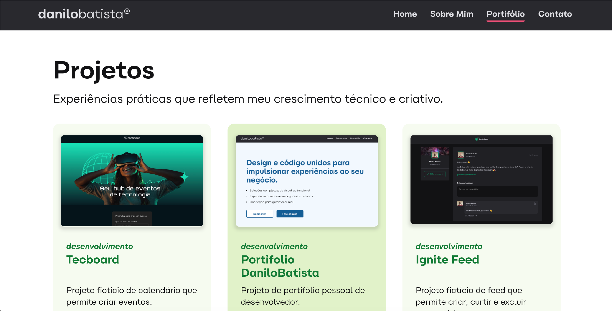

<h1>danilobatista® | Portfolio</h1>

<p style="display:flex;justify-content:space-around ">
    
    
    
</p><hr>

## Descrição do projeto

É com muito orgulho que compartilho a primeira versão do meu portfólio como Desenvolvedor Front-end! 🙌

No fim de 2024 encerrei um ciclo na MSP Estúdios e decidi retomar um antigo objetivo: migrar para a área de Tecnologia.

O primeiro semestre de 2025 foi desafiador, cheio de aprendizados e treinamentos intensivos. Agora chegou a hora de colocar a mão na massa.

👉 Tecnologias aprendidas e aplicadas nesta versão:

1. React.js: Componentização, CSS Modules, Hooks (useState, useEffect, useRef, useLocation), React Router e React Helmet
2. SASS para estilização avançada e responsividade
3. EmailJs para integração de envio de e-mails
4. Gitflow + GitHub para versionamento
5. Deploy com GitHub Pages e Vercel

📌 Além do aspecto técnico, estou estruturando este projeto como um produto em evolução, aplicando práticas inspiradas em metodologias ágeis:

- Organização do backlog
- Definição de sprints curtas para entrega de novas features
- Refatorações contínuas e incrementais

💡 O objetivo é demonstrar não só as habilidades técnicas, mas também a mentalidade de desenvolvimento iterativo e incremental, tão presente em metodologias ágeis como Scrum.

Para as próximas versões:
- Revisões de código
- Melhorias planejadas de design e usabilidade
- Inclusão dos projetos de design gráfico realizados anteriormente na minha carreira, unificando os portifólios

🔗 Confira o projeto aqui: https://www.danilobatista.com

Fiquem à vontade para explorar e me enviar feedbacks. Quem sabe a sua sugestão não entra no próximo sprint? 😉

<br />

## Requisitos atingidos

- [x] Deverá ser mobile-first;
- [x] Deverá ter uma versão tablet;
- [x] Deverá ter uma versão desktop;
- [x] Deverá usar media queries;
- [x] Deverá usar React;
- [x] Deverá ser otimizado para SEO;
- [x] Integração com uma biblioteca externa para envio de e-mails
  

<br />


## 📁 Acesso ao projeto
### Pré-requisitos

* <strong>[Git](https://git-scm.com)</strong> 
* <strong>[Node.js](https://nodejs.org/en/)</strong> 
* <strong>[NPM](https://www.npmjs.com/)</strong> 
* <strong>[Yarn](https://classic.yarnpkg.com/en/)</strong> 
* <strong>[VSCode](https://code.visualstudio.com/)</strong> ou use um editor da sua escolha.
  
Você pode acessar [o código-fonte do projeto](https://github.com/danilo-batista/nome-do-projeto.git) ou baixá-lo.

<br />

## 🛠️ Como configurar o projeto
Para executar o projeto, siga estes passos:
```bash
# Clone este repositório
$ git clone git@github.com:danilo-batista/Portifolio-DaniloBatista.git

# Acesse a pasta do projeto em seu computador via terminal ou editor de código:
$ cd Portifolio-DaniloBatista

# Instale as dependências de projeto
$ yarn install

# Execute a aplicação
$ yarn dev

# O servidor iniciará na porta indicada
Acesse o endereço indicado em seu terminal.
```

<br />

## ✔️ Técnicas e tecnologias
* <strong>[HTML](https://developer.mozilla.org/en-US/docs/Web/HTML)</strong>
* <strong>[CSS](https://developer.mozilla.org/en-US/docs/Web/CSS)</strong>
* Metodologia <strong>[BEM CSS](https://getbem.com/)</strong>
* <strong>[JavaScript](https://developer.mozilla.org/en-US/docs/Web/JavaScript)<strong>

<br />

<h2> 📫 Como entrar em contato comigo <span style="font-size: 1rem; padding: 0.5rem">😄 <em>(Ele/Dele)</em></span></h2>

<p>
    <a href="https://github.com/danilo-batista"></a>
    <a href="https://www.linkedin.com/in/danilobatista"></a>
    <a href="https://www.danilobatista.com"></a>
</p>